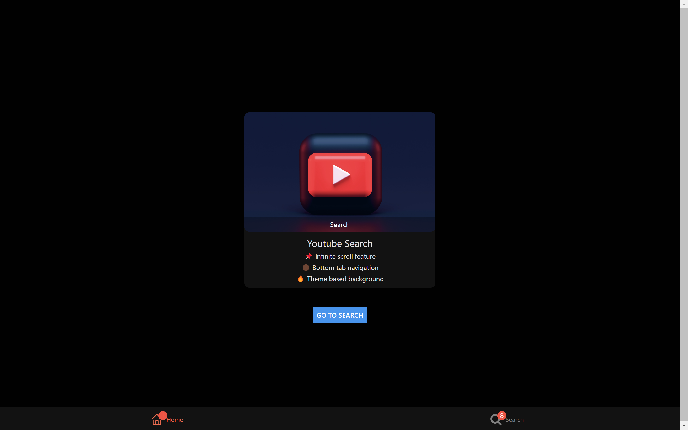
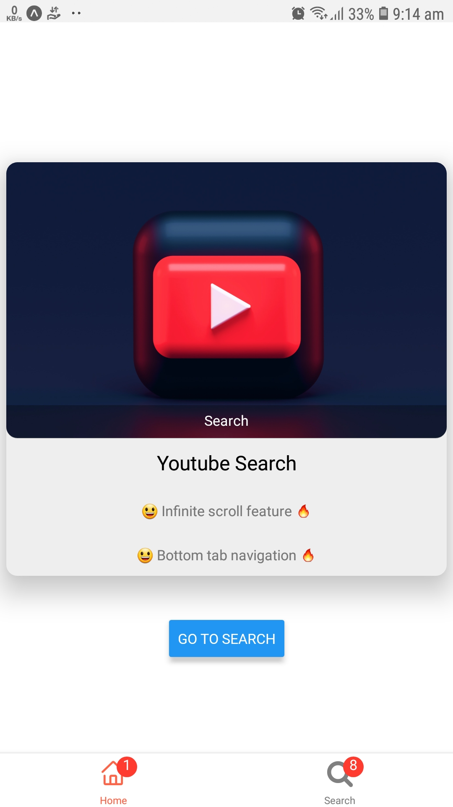
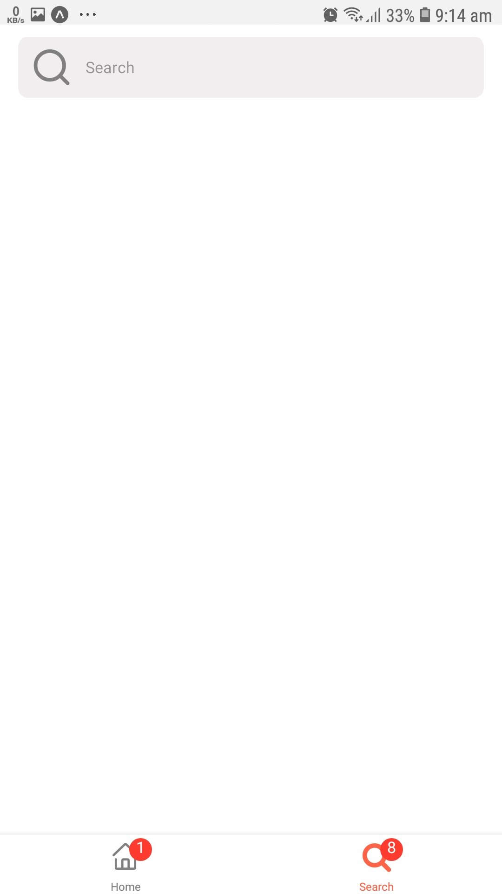
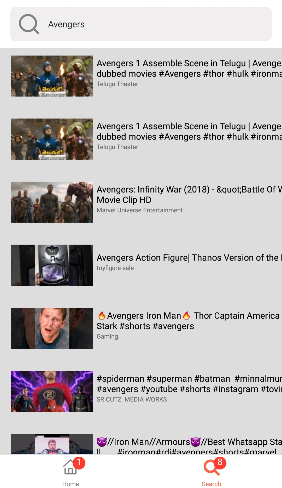
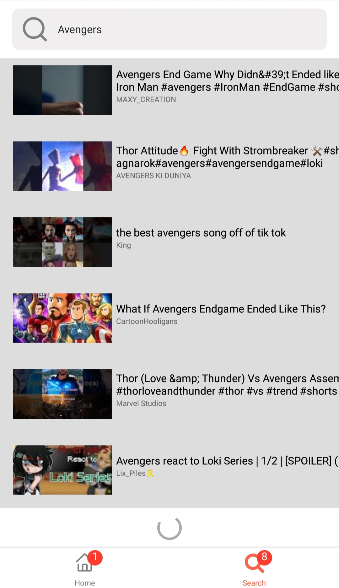

# yt-scroll 👨‍💻


## :star: Get Started

```bash
# install expo cli
npm install -g expo-cli
```

```bash
# install dependencies
npm install
```

Or use `yarn`

```bash
yarn install
```

Add .env file to the root directory of the project


Content of .env file

```bash
# change the API_KEY with your api key

BASE_URL=https://youtube.googleapis.com/youtube/v3/
API_KEY=YOUR_API_KEY
```

Run project

```bash
# run project
npm start
```

## :star: Features

- React Native expo app
- Get Search results from youtube
- Infinite scroll feature
- Background based on device theme
- Bottom Navigator for navigation

## :star: Demo :-

### Web

<div style="display: flex; margin: 1rem; justify-content: space-around; flex-wrap: wrap"></div>

### Home Page

<div style="display: flex; margin: 1rem; justify-content: space-around; flex-wrap: wrap">
 
 
</div>

### Search Results

<div style="display: flex; margin: 1rem; justify-content: space-around; flex-wrap: wrap">
 
 
</div>

## :star: Contributing

If you'd like to contribute, please fork the repository and make changes as
you'd like. Pull requests are warmly welcome. Thanks a lot.
